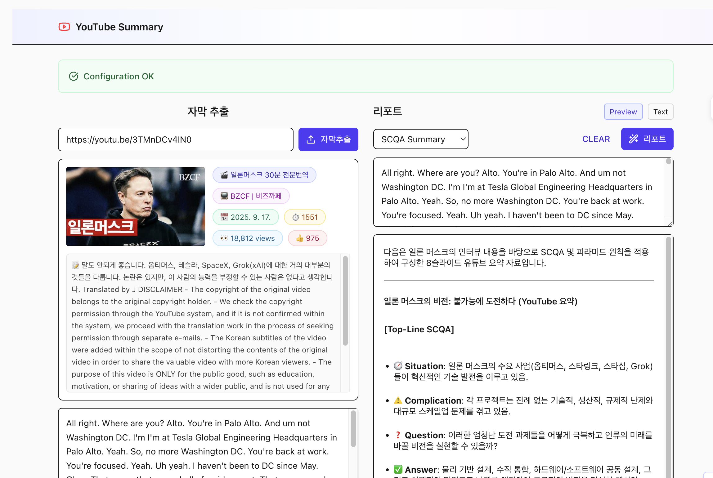

# YouTube Summary App

AI를 활용한 YouTube 동영상 자막 추출 및 요약 애플리케이션입니다.



## ✨ 주요 기능

- 🎬 **YouTube URL 자막 추출** - Supadata API 사용
- 🤖 **AI 기반 요약 생성** - Gemini 2.5 Flash 모델 사용
- 📊 **다양한 요약 형식**
  - **General**: 마크다운 형식의 체계적 요약
  - **SCQA**: 컨설팅 스타일의 8슬라이드 구조
  - **Full Report**: 상세 분석 리포트
- 🌙 **다크모드 지원**
- 📱 **반응형 디자인**

## 📺 사용 예시

YouTube URL 예시: https://youtu.be/3TMnDCv4IN0

1. 위 URL을 입력란에 붙여넣기
2. '자막추출' 버튼 클릭
3. 추출된 자막을 바탕으로 AI 요약 생성

## 🚀 빠른 시작

### 사전 요구사항

다음이 필요합니다:
- **Gemini API Key**: [Google AI Studio](https://ai.google.dev/)에서 발급
- **Supadata API Key**: [Supadata](https://supadata.ai/)에서 발급
- **GCP 프로젝트**: Google Cloud Platform 프로젝트
- **GCP 서비스 계정**: Secret Manager 접근 권한이 있는 서비스 계정

#### 🔑 Gemini API Key 발급 방법

Gemini API 키 발급은 Google AI Studio를 통해 간편하게 할 수 있습니다. Google 계정과 결제 수단만 준비되어 있으면, 몇 번의 클릭만으로 즉시 발급받을 수 있습니다.

**준비사항**
- Google 계정 (Gmail 등)
- 결제용 신용/체크 카드 (무료 제공량만 사용해도 카드 정보 등록 필요)

**발급 절차**
1. **Google AI Studio 접속**
   - [https://aistudio.google.com/apikey](https://aistudio.google.com/apikey)로 접속
2. **로그인 및 결제정보 등록**
   - Google 계정으로 로그인 후, 결제 계정(대한민국/KRW, 카드정보 등) 등록
3. **API 키 생성**
   - 상단 메뉴에서 "API 키 생성" 또는 "+ Create API key" 버튼 클릭
   - 처음이라면 자동으로 새 프로젝트가 생성됨
4. **API 키 복사 및 보관**
   - 발급되는 긴 문자열 형태의 API 키를 복사해서 안전한 곳에 저장
   - 이 키는 절대 노출하면 안 되며, 나중에 필요할 때 프로젝트 내에서 다시 확인 가능

**주의사항**
- 무료 사용량 범위 내에서는 과금이 없으나, 남용 또는 키 유출 시에는 요금이 청구될 수 있음
- API 키는 환경변수(VITE_GEMINI_API_KEY)로 관리하면 보안에 유리합니다

#### 🔑 Supadata API Key 발급 방법

Supadata API는 YouTube 자막 추출을 위한 핵심 서비스입니다. 간단한 회원가입 절차를 통해 API 키를 발급받을 수 있습니다.

**발급 절차**
1. **회원가입**
   - [https://supadata.ai/](https://supadata.ai/) 접속하여 회원가입
2. **로그인**
   - 가입한 계정으로 로그인
3. **대시보드 접속**
   - [https://dash.supadata.ai/](https://dash.supadata.ai/)로 이동
4. **API 키 발급**
   - Home에서 API 선택 후 발급
   - 발급된 API 키를 안전한 곳에 저장

**무료 사용량**
- 한 달에 100건까지 무료로 사용 가능
- 무료 한도 초과 시 유료 플랜으로 전환 필요

**주의사항**
- API 키는 GCP Secret Manager로 관리하여 보안을 유지하세요
- 키 유출 시 즉시 재발급받아 교체하시기 바랍니다

#### 🔐 API Key 관리 방식

이 애플리케이션은 **Shell Script를 통한 GCP Secret Manager 통합**을 사용합니다:

1. **환경변수 우선**: 이미 설정되어 있으면 GCP Secret Manager 호출 안함
2. **GCP Secret Manager 폴백**: 환경변수가 없을 때만 GCP에서 가져옴
3. **빌드 시점 주입**: Shell Script → GCP Secret Manager → 환경변수 → Docker 빌드 → 정적 파일

#### 🔐 GCP Secret Manager 설정 방법

프로덕션 환경에서 GCP Secret Manager를 사용하여 API 키를 안전하게 관리합니다.

**1. GCP 프로젝트 설정**
```bash
# GCP 프로젝트 ID 확인/설정
gcloud config set project YOUR_PROJECT_ID
```

**2. Secret Manager API 활성화**
```bash
gcloud services enable secretmanager.googleapis.com
```

**3. API 키를 Secret Manager에 저장**
```bash
# Gemini API Key 저장
echo "YOUR_GEMINI_API_KEY" | gcloud secrets create gemini-api-key --data-file=-

# Supadata API Key 저장
echo "YOUR_SUPADATA_API_KEY" | gcloud secrets create supadata-api-key --data-file=-
```

**4. 서비스 계정 권한 부여 (GCP VM에서 실행 시)**

GCP VM에서 실행하는 경우 기본 서비스 계정에 권한을 부여하면 됩니다:

```bash
# 현재 서비스 계정에 Secret Manager 접근 권한 부여
gcloud projects add-iam-policy-binding YOUR_PROJECT_ID \
    --member="serviceAccount:YOUR_COMPUTE_SERVICE_ACCOUNT@YOUR_PROJECT_ID.iam.gserviceaccount.com" \
    --role="roles/secretmanager.secretAccessor"
```

**참고**: GCP VM에서 실행하는 경우 메타데이터 서버를 통해 자동 인증되므로 별도의 서비스 계정 키 파일이 필요하지 않습니다.

## 📦 설치 및 실행 방법

### 1️⃣ 로컬 개발 환경

```bash
# 1. 저장소 클론
git clone <repository-url>
cd YoutubeSummary

# 2. 의존성 설치
npm install

# 3. 환경변수 설정
cp .env.example .env
# .env 파일을 열어 API 키 입력

# 4. 개발 서버 실행
npm run dev
```

**환경변수 설정 (.env 파일):**
```bash
# Gemini AI API Key (필수)
VITE_GEMINI_API_KEY=your_gemini_api_key_here

# Supadata API Key (필수)
VITE_SUPADATA_API_KEY=your_supadata_api_key_here
```

**⚠️ 보안 주의사항:**
- **Shell Script 방식**: 빌드 시점에만 GCP Secret Manager 접근, 런타임에는 정적 파일 사용
- **API Key 노출**: 정적 파일에 API key가 포함되므로 클라이언트 사이드에서 접근 가능
- **권장사항**: 프로덕션 환경에서는 서버 사이드 API 사용을 고려하세요
- **대안**: 환경변수는 개발/테스트용으로만 사용하세요

### 2️⃣ Docker로 실행

#### 방법 A: GCP Secret Manager 사용 (권장)

```bash
# 1. GCP Secret Manager를 사용하여 빌드 및 실행
./build-with-secrets.sh
```

이 스크립트는 다음을 수행합니다:
- 환경변수 확인 (있으면 사용)
- 환경변수가 없으면 GCP Secret Manager에서 API key 가져오기
- Docker 빌드 및 실행

#### 방법 B: 환경변수 직접 사용 (개발용)

```bash
# 1. 환경변수 설정
export VITE_GEMINI_API_KEY="your_gemini_api_key"
export VITE_SUPADATA_API_KEY="your_supadata_api_key"

# 2. 빌드 및 실행
docker compose build --no-cache
docker compose up -d
```

## 🔄 Shell Script 동작 방식

### `build-with-secrets.sh` 상세 동작

```bash
#!/bin/bash
# 1. 환경변수 확인
if [ -n "$VITE_GEMINI_API_KEY" ] && [ -n "$VITE_SUPADATA_API_KEY" ]; then
    echo "✅ Using existing environment variables"
else
    # 2. GCP Secret Manager에서 API key 가져오기
    export VITE_GEMINI_API_KEY=$(gcloud secrets versions access latest --secret="gemini-api-key")
    export VITE_SUPADATA_API_KEY=$(gcloud secrets versions access latest --secret="supadata-api-key")
fi

# 3. Docker 빌드 및 실행
docker compose build --no-cache
docker compose up -d
```

### 🔐 API Key 주입 과정

```
Shell Script → GCP Secret Manager → 환경변수 → Docker Build → Vite 빌드 → 정적 파일
```

**단계별 설명:**
1. **Shell Script 실행**: `./build-with-secrets.sh`
2. **GCP Secret Manager**: API key 가져오기 (환경변수가 없을 때만)
3. **환경변수 설정**: `export VITE_GEMINI_API_KEY=...`
4. **Docker 빌드**: 환경변수를 build args로 전달
5. **Vite 빌드**: 환경변수를 JavaScript에 포함
6. **정적 파일**: 브라우저에서 사용

### ⚡ 장점

- **간단함**: 복잡한 서버 사이드 API 불필요
- **안전함**: 빌드 시점에만 GCP Secret Manager 접근
- **유연함**: 환경변수 우선순위로 개발/프로덕션 환경 지원
- **효율적**: 캐시된 빌드 이미지로 빠른 배포

## 🌐 접속

애플리케이션이 실행되면 다음 URL로 접속할 수 있습니다:
- **로컬**: http://localhost:4500
- **외부 접속**: http://[서버IP]:4500

## 🔧 프로덕션 배포

### GCP VM에서 배포

```bash
# 1. GCP VM에 프로젝트 클론
git clone <repository-url>
cd YoutubeSummary

# 2. GCP Secret Manager 설정 (위 섹션 참조)

# 3. Shell Script로 배포
./build-with-secrets.sh
```

### Docker Hub에서 배포

```bash
# 1. 이미지 빌드 및 푸시
docker build -t your-username/youtube-summary .
docker push your-username/youtube-summary

# 2. 배포 시 환경변수 설정
docker run -d -p 4500:80 \
  -e VITE_GEMINI_API_KEY=your_gemini_key \
  -e VITE_SUPADATA_API_KEY=your_supadata_key \
  your-username/youtube-summary
```

## 🔒 보안 및 환경변수

### API Key 우선순위
1. **환경변수** (최우선): 개발/테스트용
2. **GCP Secret Manager** (폴백): 프로덕션용

### 보안 권장사항
- **Shell Script 방식**: 빌드 시점에만 GCP Secret Manager 접근
- **API Key 노출**: 정적 파일에 포함되므로 클라이언트 사이드 접근 가능
- **프로덕션 권장**: 서버 사이드 API 사용 고려

## 📁 프로젝트 구조

```
YoutubeSummary/
├── src/
│   ├── components/          # React 컴포넌트
│   │   ├── ConfigStatus.tsx # 설정 상태 표시
│   │   ├── TranscriptPanel.tsx
│   │   └── ReportPanel.tsx
│   ├── lib/                 # 유틸리티 및 API
│   │   ├── config.ts        # 환경변수 검증
│   │   ├── llm.ts          # Gemini AI 연동
│   │   ├── supadata.ts     # Supadata API 연동
│   │   └── youtube.ts      # YouTube 유틸리티
│   └── App.tsx
├── build-with-secrets.sh   # GCP Secret Manager 통합 빌드 스크립트
├── docker-compose.yml      # Docker Compose 설정
├── Dockerfile              # Docker 빌드 파일
├── nginx.conf             # Nginx 설정
└── README.md              # 프로젝트 문서
```

## 🛠️ 개발

### 빌드
```bash
npm run build
```

### 린트
```bash
npm run lint
```

### 프리뷰
```bash
npm run preview
```

## 🐞 문제 해결

### GCP Secret Manager 관련 오류
```bash
# 1. GCP 인증 확인
gcloud auth list

# 2. 프로젝트 설정 확인
gcloud config get-value project

# 3. Secret Manager API 활성화
gcloud services enable secretmanager.googleapis.com

# 4. 서비스 계정 권한 확인
gcloud projects get-iam-policy YOUR_PROJECT_ID
```

### API 키 관련 오류
애플리케이션에서 빨간색 경고가 표시되면:
1. `./build-with-secrets.sh` 스크립트 실행 확인
2. GCP Secret Manager에서 API key 접근 가능한지 확인
3. 환경변수가 올바르게 설정되었는지 확인

### Docker 빌드 실패
```bash
# 캐시 없이 다시 빌드
docker compose build --no-cache

# 또는 Shell Script 사용
./build-with-secrets.sh
```

### 포트 충돌
```bash
# 사용 중인 포트 확인
sudo netstat -tlnp | grep :4500

# 다른 포트 사용
# docker-compose.yml에서 포트 변경 후 재빌드
```

## 📄 라이선스

이 프로젝트는 MIT 라이선스 하에 배포됩니다.

## 🤝 기여하기

1. Fork 프로젝트
2. Feature 브랜치 생성 (`git checkout -b feature/AmazingFeature`)
3. 변경사항 커밋 (`git commit -m 'Add some AmazingFeature'`)
4. 브랜치에 Push (`git push origin feature/AmazingFeature`)
5. Pull Request 생성

## 📞 지원

문제가 발생하면 [Issues](repository-issues-url)에 등록해 주세요.